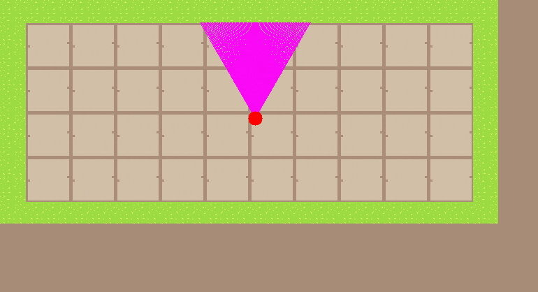

# Cub3d

## Project Overview
Simple 3d game replicating wolfstein utalizing ray casting.

- Raycasting to calculate and render walls from a 2D map grid
- Heavy use of math (trigonometry, vector arithmetic) for player movement, collision detection, and rendering using only restricted functions and libraries
- Custom game loop handling frame updates and input management
- Real-time player control via key hooks and input handling
- Rendering with MLX42, a minimal graphical library built on top of GLFW
- Parsing external map files for custom level loading
- Debugging tools and in-game feedback for visual testing

## My Role in the Project
This was our second group project at Hive Helsinki. At the beginning, we divided the responsibilities: my partner focused on map parsing, edge case handling, and ensuring the data structures were clean, reliable, and ready for rendering.

I took on the visual and gameplay side implementing raycasting, player movement, wall rendering, and the overall game loop structure. It was challenging work, especially getting the math right for accurate rendering and smooth player input. But having a solid parser to build on made the process more manageable, and let me focus fully on game mechanics and visuals.

Even though we worked on separate pieces, the project came together through shared debugging, testing, and a lot of back-and-forth to make sure both sides functioned together as a cohesive whole.

My first steps were spent studying how raycasting works starting with rendering a basic 2D minimap and experimenting with simple rays. Once that clicked, I moved on to building the wall projection logic (without textures at first), which really helped me understand the underlying math.
<p align="center">
  
</p>

This kind of low-level graphics is complex but incredibly compelling to me. One of the biggest challenges was resisting the urge to go too deep into the theory it’s easy to get lost trying to fully master every formula. Instead, I focused on implementing what I understood and improving it incrementally as the game started taking shape.

Now, looking back at this project, I see plenty of areas for improvement both visually and under the hood. I’d love to revisit it with a fresh perspective: simplify the math where possible, smooth out transitions in the bonus level, and add features like multifloor, laser shooting and enemy logic. If time allows, it's definitely something I’d enjoy expanding further.

## Usage
make for simple game, make bonus for added rat
1. Initialize the program with ```./cub3D <map_path>.cub```
2. Use `W` to move forward;
3. Use `S` to move back;
4. Use `D` to move to the right;
5. Use `A` to move to the left;
6. Use `RIGHT ARROW` to turn the angle to the right;
7. Use `LEFT ARROW` to turn the angle to the left;
8. If bonus game use `SPACE` to open and close door
9. Have fun!


## Lessons Learned 💡

**Balance your contributions thoughtfully.**  
I ended up taking on some of the more complex gameplay and rendering work and while I enjoyed the challenge, I realized that clear communication around scope, pacing, and shared ownership could’ve made things smoother for both of us. Going forward, I want to be more proactive about suggesting how we can split tasks in a balanced way, especially when something looks heavy or abstract at first glance. Even just flagging parts as "let’s tackle this together later" could lead to better collaboration and help make difficult areas feel more approachable. (splitting things into smaller tasks)

**Reading and understanding documentation matters.**  
Working with MLX42 forced me to engage deeply with library documentation something I hadn’t done much before. I gained a clearer sense of how well written comments and descriptions can guide development and reduce confusion, especially when dealing with unfamiliar APIs.
My team was particularly helpful in showing me how to write more readable code by adding descriptive briefs and consistent formatting. This is still an area I’m practicing, but I’ve come to appreciate how documentation isn't just “nice to have” it’s a core part of writing maintainable code.

**Unexpected behaviors can become design inspiration.**  
During testing, I came across visual quirks — like a miscalculated ray offset that gave the illusion of climbing stairs. With limited prior knowledge in graphics programming, I relied heavily on manual testing and real time tweaking to understand how small changes affected rendering. While time constraints kept me from exploring these quirks further, I’ve learned to treat certain bugs as creative opportunities and have started keeping more structured notes during development to revisit promising behaviors later.

**Leaning on others can be part of the learning process.**  
The math behind raycasting was one of the toughest parts of the project for me. I’m not naturally mathematically inclined, but I genuinely enjoy diving into it even when it feels over my head. Studying raycasting gave me a deeper respect for how complex these systems are, and I learned to rely on outside resources and insights from more experienced peers to make meaningful progress. Trusting what's out there and asking for help when needed became a key part of how I got through it.

**Working with game loops taught me to think in frames**
Designing a continuous game loop helped me understand how state updates, input handling, and rendering all depend on timing and sequencing. I learned how to structure logic so it runs frame by frame, and how even small delays or misordered operations can impact the smoothness of gameplay. This changed how I approach real time systems in general from debugging movement bugs to optimizing render speed.

## Team

Alexandra Raveala
- 42-profile: [https://profile.intra.42.fr/users/araveala](https://profile.intra.42.fr/users/araveala)

Felipe Dessoy
- 42-profile: [https://profile.intra.42.fr/users/fdessoy-](https://profile.intra.42.fr/users/fdessoy-)
